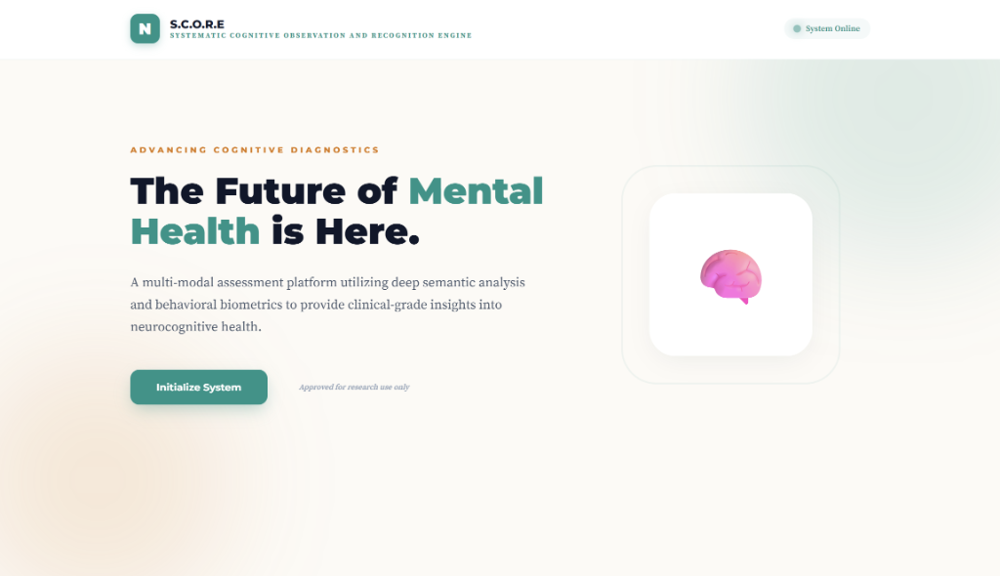
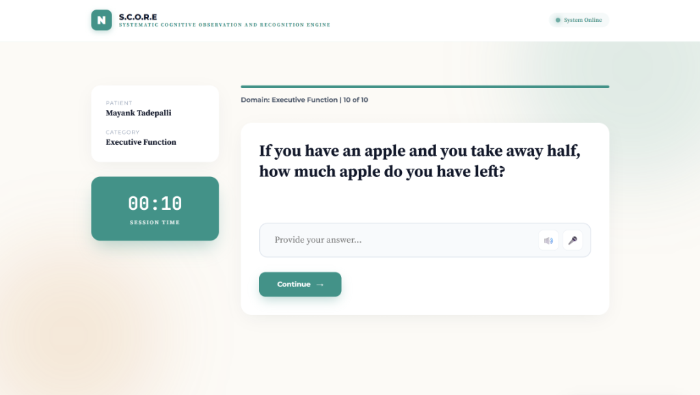
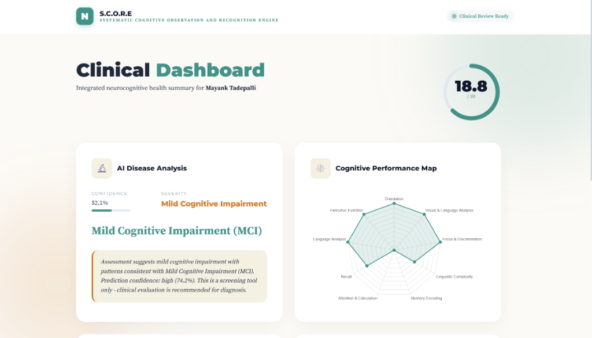
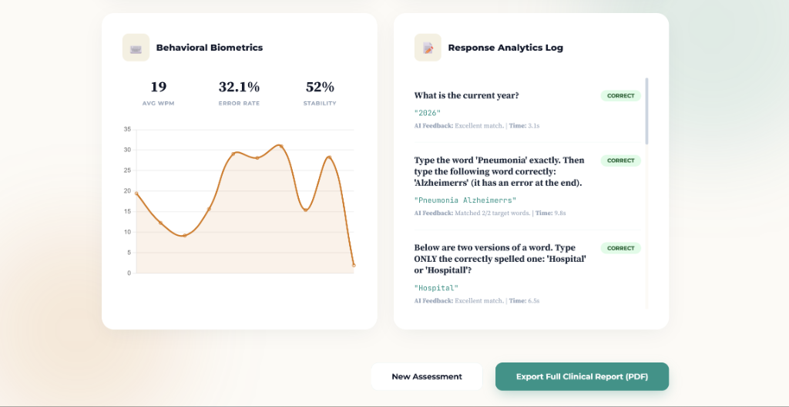
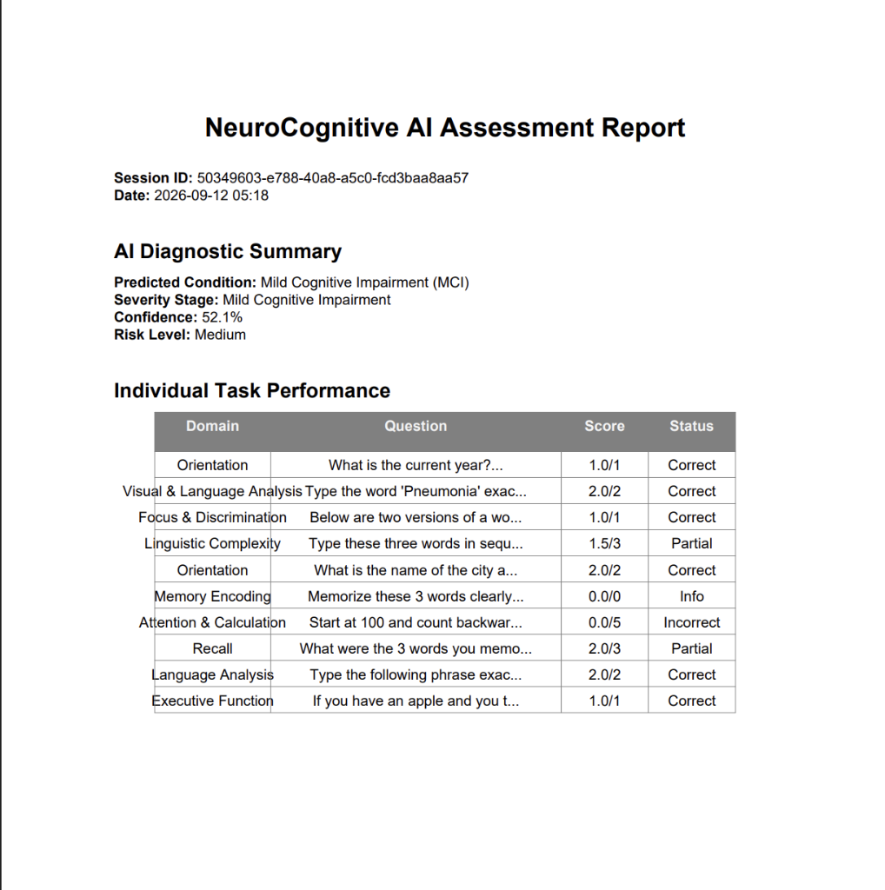

# S.C.O.R.E (Systematic Cognitive Observation and Recognition Engine)

> An intuitive, multi-modal Mini Mental State Examination (MMSE) platform for neurocognitive screening powered by semantic analysis and behavioral biometrics.

---

## 🔬 Research Publication

This repository implements the assessment platform and machine learning framework introduced in the following peer-reviewed research paper:

- **Title:** *S.C.O.R.E: A Multi-Modal Artificial Intelligence Framework for Neurocognitive Assessment via Semantic Analysis and Behavioral Biometrics*
- **Conference:** [2026 7th International Conference on Bio-engineering for Smart Technologies (BioSMART)](https://ieeexplore.ieee.org/xpl/conhome/11597967/proceeding)
- **Publisher / Index:** IEEE Xplore
- **DOI:** [10.1109/BioSMART71257.2026.11598146](https://doi.org/10.1109/BioSMART71257.2026.11598146)

---

## 🌐 Live Demo

The application is deployed and publicly accessible on Hugging Face Spaces:
👉 **[Launch S.C.O.R.E Live Demo](https://mt411-score-ai.hf.space/)**

---

## 📖 Overview

The **Mini-Mental State Examination (MMSE)** is a 30-point clinical questionnaire widely utilized to measure cognitive impairment and track changes across time in conditions such as Alzheimer’s disease and dementia. Early and accessible cognitive screening is vital for timely clinical intervention, yet traditional paper-based administrations can be labor-intensive and susceptible to subjective evaluation.

**S.C.O.R.E** digitizes and elevates the standard MMSE into an automated multi-modal assessment engine. By coupling semantic embedding comparison (Sentence-Transformers SBERT) with fine-grained keystroke dynamics (typing speed, error types, and temporal pause analysis) and ensemble machine learning (XGBoost + Random Forest), the platform provides automated 30-point scoring, cognitive domain breakdown, and AI-driven risk stratification with downloadable clinical PDF reports.

---

## ✨ Key Features

- **Standardized Multi-Domain MMSE Assessment**: Dynamic assessment battery spanning core cognitive domains — *Orientation*, *Visual & Language Analysis*, *Focus & Discrimination*, *Linguistic Complexity*, *Memory Encoding*, *Attention & Calculation*, *Recall*, and *Executive Function*.
- **Semantic & Fuzzy Scoring Engine**: Evaluates free-text answers using cosine similarity over Sentence-BERT (ll-MiniLM-L6-v2) embeddings with sequence-matching fallbacks (SequenceMatcher) for typo tolerance, multi-word corrections, and recall sets.
- **Behavioral Keystroke Biometrics**: Real-time extraction of typing dynamics, including Words Per Minute (WPM), character count, error categorization (substitutions, omissions, additions, transpositions), consistency, and temporal hesitation stability.
- **52-Feature Cognitive Profiling**: Aggregates response accuracy, domain performance, and typing telemetry into a comprehensive 52-dimensional feature vector.
- **Ensemble Impairment Prediction & Interpretability**: Dual-model ensemble combining XGBoost and Random Forest with heuristic baseline weighting to predict cognitive health stages (*Normal Cognition*, *Mild Cognitive Impairment [MCI]*, *Moderate*, *Severe*) alongside SHAP tree-explainer attribution.
- **Interactive Clinical Dashboard**: Dark/light-responsive diagnostic dashboard featuring scaled 30-point MMSE scores, interactive cognitive radar performance maps, typing biometrics charts, and granular response logs.
- **Automated Clinical PDF Generation**: One-click generation and streaming of structured neurocognitive assessment reports via ReportLab.
- **Text-to-Speech & Voice Accessibility**: Built-in voice reading (pyttsx3 / Web Speech) and audio prompts to assist patients with reading difficulties.

---

## 🛠️ Tech Stack

### Backend & Machine Learning
- **Framework:** [FastAPI](https://fastapi.tiangolo.com/) (Asynchronous REST API & Web Server)
- **ASGI Server:** Uvicorn / Gunicorn
- **NLP / Semantic Embeddings:** [Sentence-Transformers](https://sbert.net/) (ll-MiniLM-L6-v2), PyTorch (CPU-optimized)
- **Machine Learning:** [XGBoost](https://xgboost.readthedocs.io/), [scikit-learn](https://scikit-learn.org/) (Random Forest), [SHAP](https://shap.readthedocs.io/)
- **Data & Text Processing:** pandas, numpy, python-Levenshtein
- **Data Validation & Schemas:** Pydantic v2
- **PDF Generation:** ReportLab
- **Audio & Accessibility:** pyttsx3, SpeechRecognition

### Frontend
- **Templates & Views:** Jinja2 (HTML5)
- **Styling:** Custom CSS (Modern clinical theme with responsive cards and typography)
- **Interactivity & Charts:** Vanilla JavaScript (ES6+), Plotly.js / Chart.js for radar and biometrics plots, Web Speech API

---

## 📸 Screenshots

### 1. System Interface (Landing Page)

### 2. Assessment Interface

### 3. Results & Scoring Dashboard — Clinical Summary & Radar Map

### 4. Results & Scoring Dashboard — Biometrics & Response Log

### 5. Sample Clinical Report Output (PDF)

---

## 🚀 Setup & Installation

### Prerequisites
- Python 3.10+ (Python 3.11 / 3.12 supported)
- Git

### 1. Clone the Repository
`ash
git clone https://github.com/mayankt411/S.C.O.R.E.git
cd S.C.O.R.E
`

### 2. Create and Activate Virtual Environment
`ash
python -m venv .venv

# Windows (PowerShell):
.venv\Scripts\Activate.ps1

# Linux / macOS:
# source .venv/bin/activate
`

### 3. Install Dependencies
`ash
pip install -r requirements.txt
`

### 4. Run the Application
`ash
python main.py
`
Or with Uvicorn directly:
`ash
uvicorn main:app --host 0.0.0.0 --port 8000 --reload
`

Open your browser and navigate to **http://localhost:8000** to launch the assessment.

---

## 📁 Project Structure

`
S.C.O.R.E/
├── core/
│   ├── ml_models/
│   │   ├── disease_predictor.py   # Ensemble ML predictor (XGBoost + Random Forest + SHAP)
│   │   ├── feature_extractor.py   # 52-dimensional cognitive feature extraction
│   │   └── synthesizer.py         # Synthetic cognitive feature generation
│   ├── config.py                  # Domain thresholds, MMSE cutoffs, and constants
│   ├── data_manager.py            # ReportLab clinical PDF export and data persistence
│   ├── questions.py               # Dynamic MMSE cognitive assessment battery
│   ├── scoring_engine.py          # SBERT semantic cosine similarity & fuzzy matcher
│   ├── typing_analyzer.py         # Keystroke dynamics, WPM, and error opcode analysis
│   └── voice_engine.py            # Text-to-speech and audio feedback helper
├── images/                        # UI screenshots and sample assessment outputs
│   ├── system_interface.png
│   ├── assessment_interface.png
│   ├── clinical_dashboard_top.png
│   ├── clinical_dashboard_bottom.png
│   └── sample_report_output.png
├── static/
│   ├── css/style.css              # Custom styling for assessment and dashboard
│   └── js/app.js                  # Dynamic client-side assessment flow and charting
├── templates/
│   └── index.html                 # Single-page assessment and clinical dashboard view
├── Dockerfile                     # Containerization for Hugging Face / Cloud deploy
├── main.py                        # FastAPI application entry point and REST endpoints
├── schemas.py                     # Pydantic data schemas and validation models
├── requirements.txt               # Project dependencies
├── LICENSE                        # MIT License
└── README.md                      # Project documentation
`

---

## 📜 Citation

If you reference this work or use the S.C.O.R.E framework in your research, please cite:

`ibtex
@inproceedings{score2026biosmart,
  title     = {S.C.O.R.E: A Multi-Modal Artificial Intelligence Framework for Neurocognitive Assessment via Semantic Analysis and Behavioral Biometrics},
  booktitle = {2026 7th International Conference on Bio-engineering for Smart Technologies (BioSMART)},
  year      = {2026},
  publisher = {IEEE},
  doi       = {10.1109/BioSMART71257.2026.11598146}
}
`

---

## 📄 License

This project is licensed under the [MIT License](LICENSE).
